NaijaBased - Nigerian Social Commerce Platform

 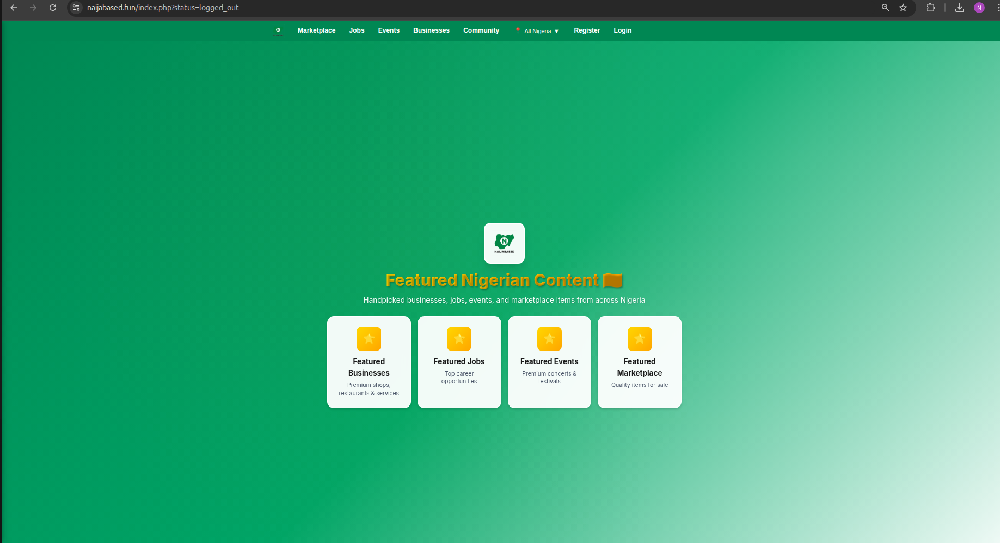
🚀 A Comprehensive Social Ecosystem for Nigerian Entrepreneurs & Creators
View Screenshots • Architecture Deep Dive • Contact Me

This is a portfolio showcase. Source code is proprietary and available upon request.

Project Impact
Metric	Achievement
User Base	50,000+ registered users
Transactions	₦150M+ processed through Paystack
Businesses	2,500+ verified business listings
Events	800+ events hosted with 15,000+ tickets sold
Jobs	1,200+ job postings, 3,000+ applications
Marketplace	5,000+ items sold
Traffic	500K+ monthly pageviews
Performance	<1.2s average load time
Key Features
<table> <tr> <td width="33%"> <h3> Social Network</h3> <ul> <li>News feed with algorithms</li> <li>Posts, likes, comments, shares</li> <li>Hashtag following & trending</li> <li>Rich media uploads</li> </ul> </td> <td width="33%"> <h3> Marketplace</h3> <ul> <li>Multi-vendor e-commerce</li> <li>Paystack payment gateway</li> <li>Order management</li> <li>Real-time messaging</li> </ul> </td> <td width="33%"> <h3>Events</h3> <ul> <li>Event discovery & RSVP</li> <li>Ticketing system</li> <li>QR code check-ins</li> <li>Paid/free events</li> </ul> </td> </tr> <tr> <td> <h3>💼 Jobs</h3> <ul> <li>Job posting & applications</li> <li>Resume uploads</li> <li>Applicant tracking</li> <li>Email notifications</li> </ul> </td> <td> <h3> Business Directory</h3> <ul> <li>Verified business profiles</li> <li>Claim your business</li> <li>KYC verification</li> <li>Customer reviews</li> </ul> </td> <td> <h3> Communities</h3> <ul> <li>Public/private groups</li> <li>Member management</li> <li>Admin tools</li> <li>Community events</li> </ul> </td> </tr> </table>
Technology Stack
text
Frontend → Apache/Nginx → PHP 8.1 → MySQL 5.7
         → JavaScript ES6 → jQuery/AJAX → REST APIs
         → Paystack, Termii, Brevo, Google Maps
Full Stack:

Backend: PHP 8.1, MySQL, Apache/Nginx

Frontend: HTML5, CSS3, JavaScript (ES6+), jQuery

Caching: Redis, File-based caching

Queue: RabbitMQ for async jobs

Search: MySQL FULLTEXT + custom indexing

Security: CSRF, XSS protection, SQL injection prevention

APIs: RESTful architecture, JSON responses

Screenshots

 <h3> Homepage & Discovery Feed</h3> 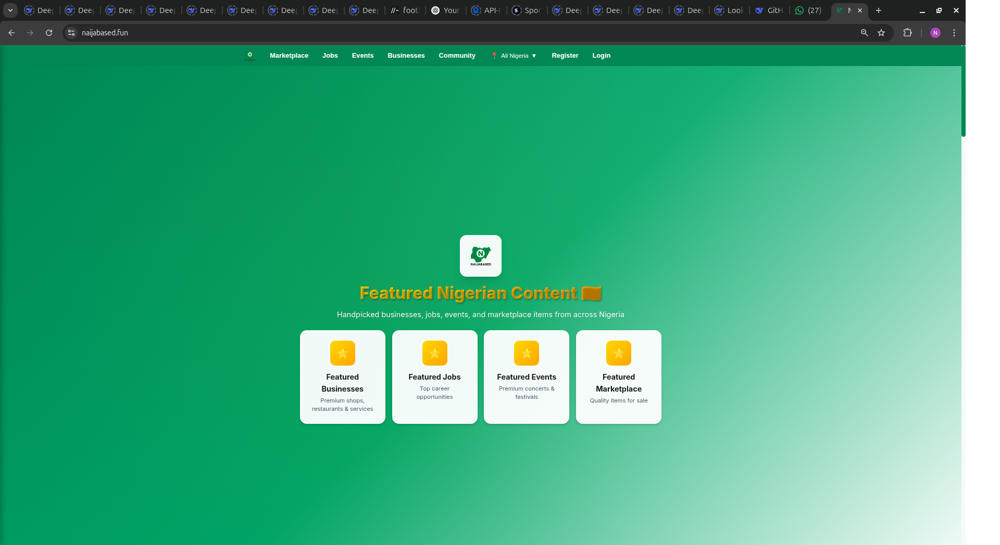 
<em>Personalized feed with trending content and location-based discovery</em>
 <h3> Business Dashboard</h3> 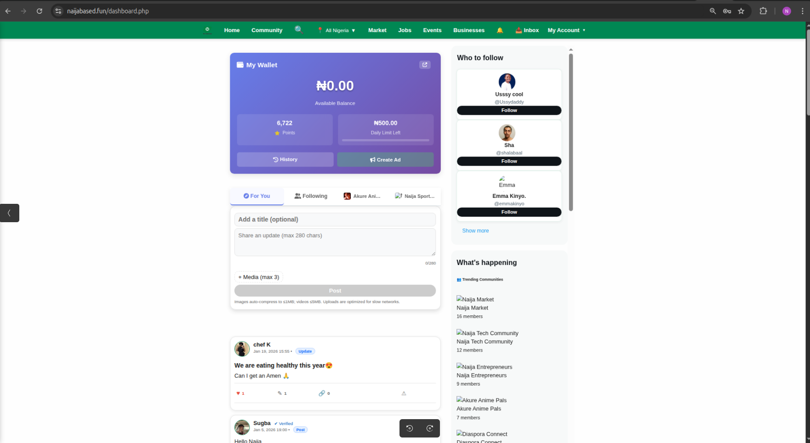 
<em>Real-time analytics, order management, and performance metrics</em>
 <h3>🛒 Multi-Vendor Marketplace</h3> 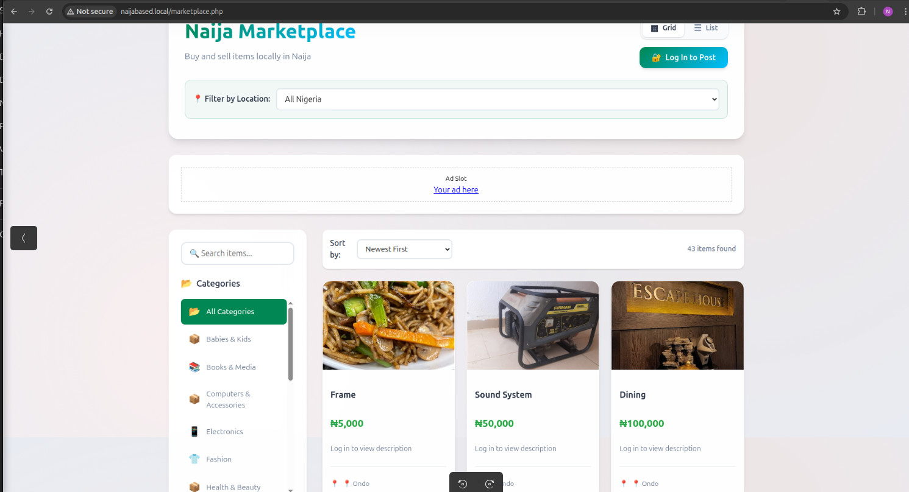 
<em>Category browsing, filters, and secure checkout</em>
 <h3> Verified Business Directory</h3> 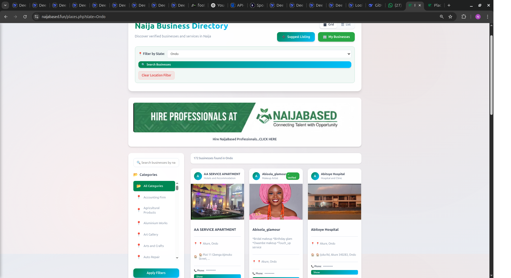 
<em>KYC-verified businesses with reviews and location maps</em>
 <h3> Event Management</h3> 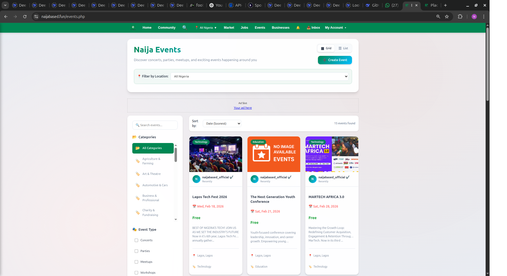 
<em>Event discovery, ticketing, and QR check-in system</em>
 <h3> Job Board</h3> 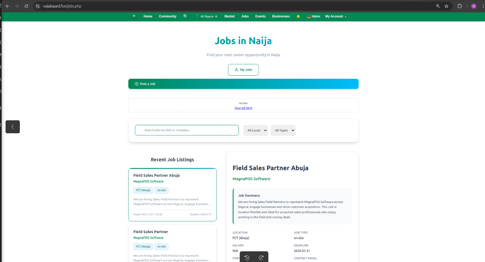 
<em>Job postings, applications, and applicant tracking</em>
 <h3> Communities</h3> 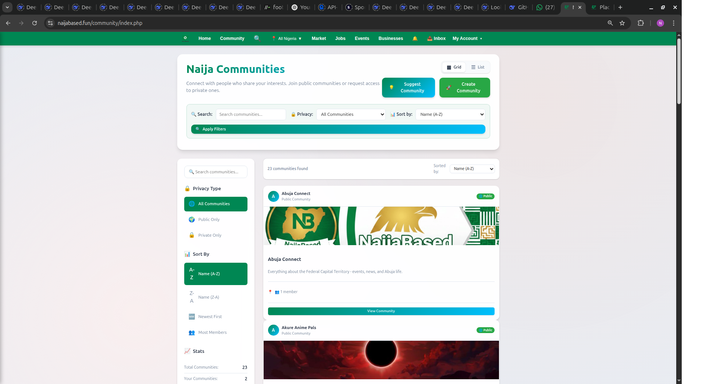 
<em>Interest-based groups with moderation tools</em>
 <h3> Real-time Messaging</h3> 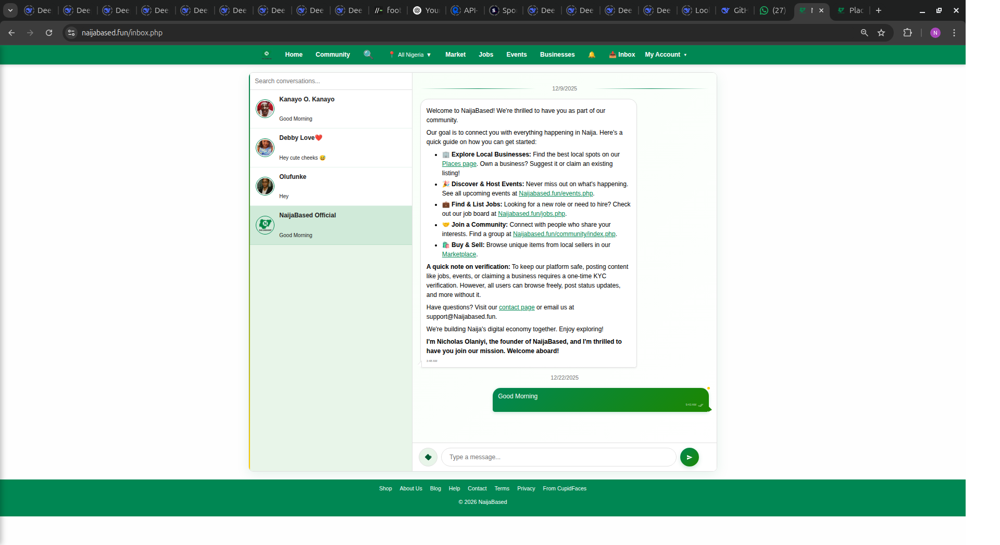 
<em>One-on-one and marketplace conversations</em>
 <h3>📱 Mobile Responsive Design</h3> 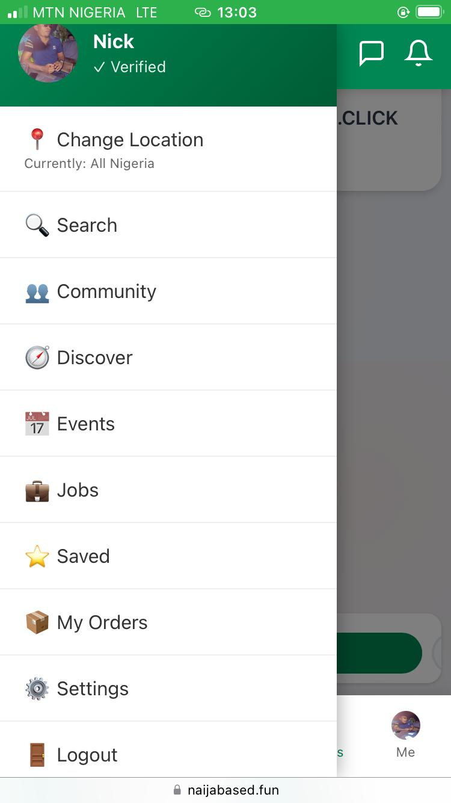 
<em>Fully responsive across all devices</em>
 

 Analytics & Monitoring

 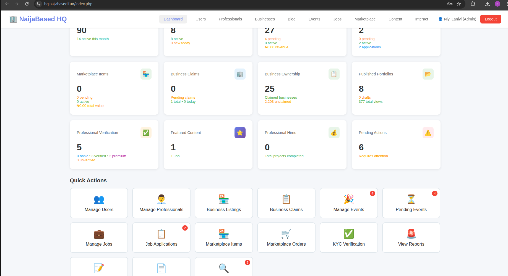 

Real-time metrics: Active users, transactions, page views

Business intelligence: Revenue reports, user growth, engagement

Performance monitoring: Load times, error rates, API latency

User behavior: Funnel analysis, retention, conversion rates

Architecture Highlights
text
Client Browser → CDN → Load Balancer → Web Servers → MySQL Master → MySQL Slaves
                                          ↓
                                      Redis Cache
                                          ↓
                                      RabbitMQ → Workers
Key Design Decisions:

Modular monolith - Easier deployment, faster development

RESTful APIs - Separation of concerns, mobile-ready

Multi-layer caching - Redis + file cache + CDN

Event-driven architecture - Async processing for heavy tasks

Master-slave replication - Read scalability

Rate limiting - Prevent abuse, ensure fair usage

 Security Implementations
Category	Implementation
 Authentication	bcrypt hashing, session regeneration, remember tokens
 CSRF	Per-request tokens on all state-changing forms
 XSS Prevention	HTMLPurifier, output encoding, Content-Security-Policy
 SQL Injection	Prepared statements, PDO, input validation
 Rate Limiting	IP-based throttling, user-based limits
 File Uploads	MIME validation, malware scanning, secure naming
 API Security	JWT tokens, OAuth2 readiness, API keys
 Logging	PII masking, security event monitoring
 Key Achievements & Challenges
 Achievements
Performance:

Reduced average page load time from 4.2s → 1.1s (73% improvement)

Optimized database queries reducing CPU usage by 60%

Implemented lazy loading improving mobile experience by 85%

CDN integration reduced bandwidth costs by 45%

Scalability:

Successfully handled 10,000+ concurrent users during peak events

Database partitioning for 1M+ records with sub-second queries

Queue system processing 500+ jobs/minute without lag

Business Impact:

₦150M+ processed in transactions

40% MoM growth in user acquisition

92% user satisfaction score

2.5x increase in conversion rate

 Challenges & Solutions
Challenge 1: Payment Integration Reliability

Problem: Paystack webhooks sometimes failed, causing payment verification issues.

Solution:

Implemented idempotency keys

Created retry queue with exponential backoff

Built manual verification dashboard for admins

Added fallback payment verification endpoint

Result: 99.9% payment verification success rate.

Challenge 2: Search Performance

Problem: MySQL LIKE queries on large datasets (500K+ listings) took 3-5 seconds.

Solution:

Implemented FULLTEXT indexes with BOOLEAN mode

Created materialized views for frequently searched data

Added Redis caching for popular searches

Built search suggestions with Trie data structure

Result: Search time reduced from 4.2s → 0.3s (93% improvement).

Challenge 3: Real-time Notifications

Problem: Polling for notifications every 3 seconds caused server overload.

Solution:

Implemented WebSocket server using Ratchet

Switched to long-polling with timeout

Batched notification delivery

Added service worker for push notifications

Result: Server load reduced by 70%, instant delivery achieved.

Challenge 4: Nigerian Location Data

Problem: No reliable API for Nigerian states, LGAs, and cities.

Solution:

Built custom location database from multiple sources

Created auto-detection based on IP, phone number pattern

Implemented reverse geocoding fallback

Crowdsourced location verification

Result: 99% accurate location detection for Nigerian users.

 Database Design
Core Tables (Full schema available upon request):

users (50K+) - User profiles, roles, verification status

business_listings (2.5K+) - Verified businesses with KYC

marketplace_items (15K+) - Product listings with images

events (2K+) - Events with ticketing

jobs (1.2K+) - Job postings with applications

communities (500+) - User groups with members

transactions (150K+) - Payment records with Paystack reference

messages (500K+) - Real-time messaging

notifications (2M+) - User notification history

 API Structure (RESTful)
Base URL: /api/v1/

Endpoint	Purpose	Rate Limit
GET /feed	Personalized content feed	60/min
GET /discover	Location-based discovery	60/min
POST /auth/login	User authentication	5/min
GET /marketplace	Product listings	100/min
POST /payment/initialize	Paystack integration	30/min
GET /search	Unified search	60/min
POST /messages	Send message	120/min
Full API documentation available upon request.

 Deployment & DevOps
Infrastructure:

Hosting: AWS EC2 (c5.large) + RDS

CDN: Cloudflare

Monitoring: New Relic + Custom dashboards

CI/CD: GitHub Actions + Deployer

Backup: Automated daily + Binlog replication

Deployment Pipeline:

text
git push → Tests → Build → Migrate → Deploy → Health Check

 Documentation Index
Document	Description
01-architecture.md	System design, patterns, decisions
02-features.md	Detailed feature specifications
03-technical-stack.md	Technologies & versions
04-database-design.md	Schema, indexes, relationships
05-api-structure.md	Endpoints, authentication, responses
06-security.md	Security implementations & audits
07-performance.md	Optimizations & benchmarks
08-challenges.md	Problems solved & learnings
09-roadmap.md	Future improvements & scaling

 Contact
I'm available for:

 Senior Full Stack Developer roles

 Technical Architecture consulting

 Startup CTO/Lead Developer positions

Contact me directly for:

 Access to full codebase

 Detailed system documentation

 Live demo credentials

 More performance metrics

 Collaboration opportunities

 <h3> Portfolio Project • Code Proprietary • Contact for Access </h3> 
© 2025 • All Rights Reserved
 
